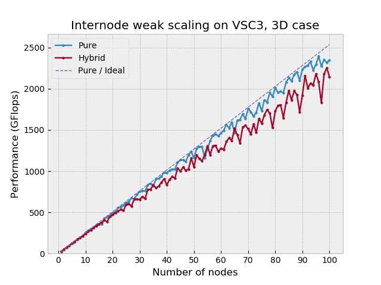
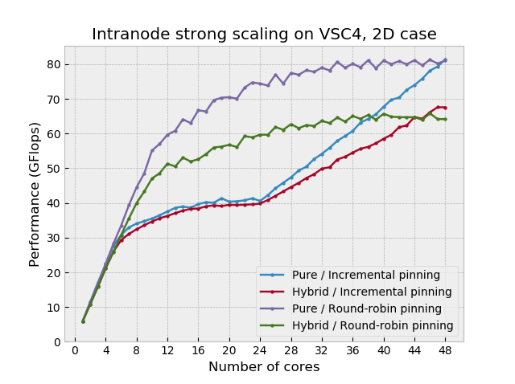
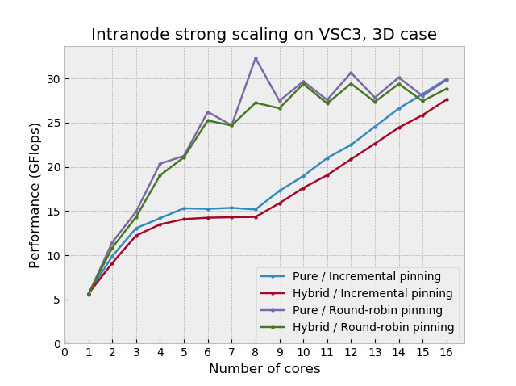

# Hybrid implementation of Jacobi algorithm

<p align="center"></img></p>

## Summary
This is an MPI parallel implementation of the Jacobi algorithm that is meant to exploit both distributed and shared memory.
This does not make use of threads: physical shared memory is managed through MPI one-sided communication features of MPI 3.0.

## Motivation and Description
This project aims to develop a numerical solver of a differential equation using the so called Jacobi algorithm. In layman's terms this simple algorithm iteratively computes a grid of points from a previous one in which every point depends only on its neighbours in the previous grid.
If the grid gets splitted in sub-grids (in order to feed different distributed nodes), points at the boundaries will depend on points which are
not in the same sub-grid. A data communication among sub-grids is therefore needed; this aspect will mostly characterise the performance of the program.
Jacobi is not the best candidate to carry out the numerical job, but here the main goal is to deal with all the issues that come with the distributed + shared memory paradigm and providing an implementation suitable for supercomputers.

## Tools
Some hybrid programming models combine two different standards like MPI and OpenMP to take advantage of the underlying architecture, however in my project I will pursue different path, using MPI 3.0 shared memory that allows to exploit shared 
memory by means of the so called one-sided communications feature.

## Command line options
The following is a complete list of command line options that the software supports (3D version):

```
Usage: jacobi [-m] [-s=DIRECTION] [-n=DIRECTION] [-H=NUM] [-i=FILENAME] [-h]

If no input file is specified, the instance data will be requested in the standard input (stdin).
List of options:

 -m, --no-shared-memory
        Choose whether to use the shared memory.

 -s, --split-direction=DIRECTION
        Direction along which to split the workload in the shared memory. Available values are X, Y or Z. Default value is X.

 -n, --cart-no-split-direction=DIRECTION
        Select along which direction the cartesian topology should be flattened. Available values are X, Y or Z.

 -H, --heads-per-shared-region=NUM
        Set how many 'head' processes will be instantiated per each physical shared region of memory. Default value is 1.

 -i, --input-instance=FILENAME
        Input file with domain sizes and parameters one per line: size x, size y, size z, alpha, relaxation, tolerance, max iterations.

 -h, --help
        Show this help message.

Author          : Federico Sossai, federico.sossai@gmail.com
Source code     : https://github.com/fsossai/jacobi-hybrid
```

## Benchmarks

All benchmarks have been done on partitions of the computing node of the supercomputers kindly provided by
[Vienna Scientific Cluster](https://vsc.ac.at/).
The three clusters used are called [VSC3](https://vsc.ac.at/systems/vsc-3/), [VSC3plus](https://vsc.ac.at/systems/vsc-3/) and
[VSC4](https://vsc.ac.at/systems/vsc-4/);
the latter system is ranked 105 in the TOP500 list at the time of writing (September 2020).

<p align="center"></img></p>

The internode results have been carried out using [weak scaling](https://en.wikipedia.org/wiki/Scalability#Weak_versus_strong_scaling)
keeping the problem size large in order to avoid non-realistic speedups generally obtained when smaller problems fit into the cache.
In the plots, _Pure_ refers to the version that do not consider the shared memory within each node,
whereas _Hybrid_ assigns a communicating process per socket and the others works inside its shared memory
using MPI One-sided communications therefore, a socket is considered as the shared memory region.
The pure version scales almost perfectly but the hybrid one is not able to be on-par.
A reason for this may be traced back to implementation details of the MPI One-sided communications.

<p align="center"></img></p>

Process **pinning** plays a fundamental role in affecting the intranode scaling.
For VSC4 _Incremental pinning_ is obtained setting `export I_MPI_PIN_PROCESSOR_LIST=0-47`, whereas _Round-robin pinning_ is obtained with `export I_MPI_PIN_PROCESSOR_LIST=allcores:grain=1,shift=24`.
For VSC3 _Incremental pinning_ is obtained setting `export I_MPI_PIN_PROCESSOR_LIST=0-15`, whereas _Round-robin pinning_ is obtained with `export I_MPI_PIN_PROCESSOR_LIST=allcores:grain=1,shift=8`.

<p align="center"></img></p>

As it can be seen from the to intranode plots, using the incremental pinning, the memory bandwidth of the socket saturates quickly
limiting the scalability. As soon as the second socket comes into play, the scaling gets linear again, this time with a lower slope
because in this system, the Quick Path Interconnect provides half of the bandwidth w.r.t. the bus.
On the other hand, filling the sockets in a round-robin fashion, saturates the memory bandwidth slower, but eventually reaching
the same performance level.

The 3D version of the intranode scaling on VSC3 shows clearly how the domain decomposition can affect the performance: the highest peek is obtained
at 8 cores, that is, a perfect 2x2x2 cubic cartesian topology.

Details of a VSC4's node:
```
CPU name:       Intel(R) Xeon(R) Platinum 8174 CPU @ 3.10GHz
CPU type:       Intel Skylake SP processor
CPU stepping:   4
Sockets:                2
Cores per socket:       24
Threads per core:       2
```

Details of a VSC3's node:
```
CPU name:       Intel(R) Xeon(R) CPU E5-2650 v2 @ 2.60GHz
CPU type:       Intel Xeon IvyBridge EN/EP/EX processor
Sockets:                2
Cores per socket:       8
Threads per core:       2
```

Details of a VSC3plus' node:
```
CPU name:       Intel(R) Xeon(R) CPU E5-2660 v2 @ 2.20GHz
CPU type:       Intel Xeon IvyBridge EN/EP/EX processor
CPU stepping:   4
Sockets:                2
Cores per socket:       10
Threads per core:       2
```

## Acknoledgements

This project has been developed during my participation to [PRACE Summer of HPC](https://summerofhpc.prace-ri.eu/info/) 2020.
I would like to thank [Claudia Blaas-Schenner](https://tiss.tuwien.ac.at/fpl/person/index.xhtml?cid=1), [Irene Reichl](https://tiss.tuwien.ac.at/fpl/person/index.xhtml?id=106886) and [David Fischak](linkedin.com/in/davidfischak) for their support.
I'm also thankful to [PRACE](https://prace-ri.eu/), [VSC](https://vsc.ac.at/) and [TU Wien](https://www.tuwien.at/) for giving me
this opportunity.

<p align="center"></img></p>
<p align="center"></img></p>
